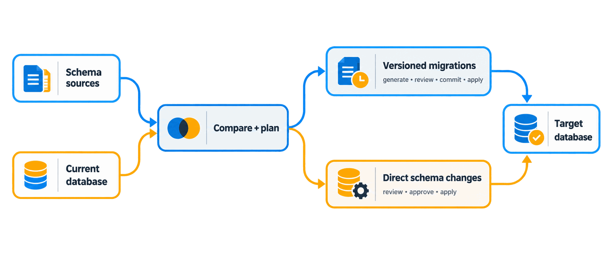
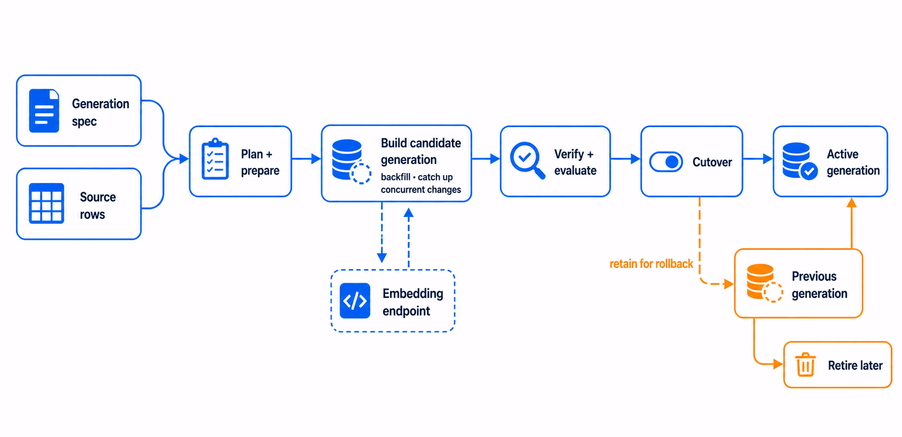

<p align="center"></p>

<h1 align="center">Ptah</h1>

<p align="center">Open-source database change management for schemas and persistent inference state.</p>

<p align="center">
  <a href="https://github.com/stokaro/ptah/actions/workflows/go-unit-tests.yml?query=branch%3Amaster"></a>
  <a href="https://github.com/stokaro/ptah/releases/latest"></a>
  <a href="https://pkg.go.dev/go.5x5.cz/ptah"></a>
  <a href="https://github.com/stokaro/ptah/blob/master/go.mod"></a>
  <a href="https://github.com/stokaro/ptah/blob/master/LICENSE"></a>
</p>

<p align="center"><a href="#install">Install</a> · <a href="https://stokaro.github.io/ptah/edge/start/quick-start/">Quick start</a> · <a href="https://stokaro.github.io/ptah/edge/inference/overview/">Inference migrations</a> · <a href="https://stokaro.github.io/ptah/edge/">Documentation</a> · <a href="https://stokaro.github.io/ptah/edge/databases/support-matrix/">Database support</a></p>

<p align="center">
  <a href="https://stokaro.github.io/ptah/edge/databases/postgresql/">PostgreSQL</a> ·
  <a href="https://stokaro.github.io/ptah/edge/databases/support-matrix/">MySQL</a> ·
  <a href="https://stokaro.github.io/ptah/edge/databases/support-matrix/">MariaDB</a> ·
  <a href="https://stokaro.github.io/ptah/edge/databases/sqlite/">SQLite</a> ·
  <a href="https://stokaro.github.io/ptah/edge/databases/sqlserver/">SQL Server</a> ·
  <a href="https://stokaro.github.io/ptah/edge/databases/support-matrix/">ClickHouse</a> ·
  <a href="https://stokaro.github.io/ptah/edge/databases/support-matrix/">CockroachDB</a> ·
  <a href="https://stokaro.github.io/ptah/edge/databases/support-matrix/">YugabyteDB</a> ·
  <a href="https://stokaro.github.io/ptah/edge/databases/support-matrix/">Oracle</a> ·
  <a href="https://stokaro.github.io/ptah/edge/databases/support-matrix/">Spanner</a>
</p>

Ptah manages database change across schemas and persistent inference state. For
schemas, it compares a desired schema with a live database and either writes
versioned migrations or applies an approved plan directly. For inference state,
it builds a candidate generation beside the active one, calls an external
embedding endpoint, verifies the result, and switches consumers with a rollback
path.

The command-line interface runs without a Go toolchain, and the same planning
components are available as Go packages.

## Schema changes

<p align="center"></p>

Both workflows use the same comparison and planning model. The difference is
whether SQL becomes a reviewed artifact in version control before it runs.

## Persistent inference state

Ptah orchestrates the migration; it does not run inference. It reads source
rows, calls the external endpoint, and writes the candidate generation itself,
leaving the active generation untouched until verification and cutover.

<p align="center"></p>

The [inference migrations guide](https://stokaro.github.io/ptah/edge/inference/overview/)
covers the specification, concurrent-change catch-up, evaluation, approvals,
rollback, and retirement.

> [!NOTE]
> Ptah is pre-GA. The native command tree and public Go API can still change.

## Install

The installer selects the current release for Linux, macOS, or Windows, verifies
its checksum, and installs `ptah`, `ptah-compat`, and `ptah-ls` under your home
directory.

```bash
curl -fsSL https://stokaro.github.io/ptah/install.sh | sh
```

In PowerShell:

```powershell
irm https://stokaro.github.io/ptah/install.ps1 | iex
```

The [installation guide](https://stokaro.github.io/ptah/edge/start/install/)
covers version pinning, signature verification, download-without-execution,
and building from source.

<!-- ptah:readme-example -->
## Try Ptah with SQLite

Save this desired schema as `schema.sql`:

```sql
CREATE TABLE users (
    id INTEGER PRIMARY KEY,
    email TEXT NOT NULL UNIQUE
);
```

Render the SQL, apply it to a throwaway database, and check that the database
matches the file:

```bash
ptah schema render --schema-file schema.sql --dialect sqlite
ptah schema apply --db-url "sqlite://app.db" --schema-file schema.sql --auto-approve
ptah schema drift --db-url "sqlite://app.db" --schema-file schema.sql
```

Expected output includes:

```text
CREATE TABLE "users" (
```

Expected output includes:

```text
Schema apply completed successfully.
```

Expected output includes:

```text
No schema drift detected.
```

The last command exits 0 when the database matches the file, which is what makes
it usable as a CI gate. Remove `app.db` and `schema.sql` when you are done.

> [!CAUTION]
> `--auto-approve` skips the confirmation prompt. A direct schema change can
> drop objects that the desired schema does not declare. Use it here only
> because `app.db` is disposable.

For a complete workflow with expected output and verification, use the
[direct schema changes tutorial](https://stokaro.github.io/ptah/edge/start/quick-start-direct/)
or the
[versioned migrations tutorial](https://stokaro.github.io/ptah/edge/start/quick-start-migrations/).

## Choose how schema changes land

| Workflow | Use it when | Start with |
| --- | --- | --- |
| Versioned migrations | SQL files belong in code review and deployment history | `ptah migrations generate` |
| Direct schema changes | The desired schema is authoritative and you want to review and apply the plan now | `ptah schema plan` |

Schema sources can come from SQL, YAML, HCL, DBML, Go annotations, external
loaders, or a live database. Database and feature coverage vary by engine; use
the [support matrix](https://stokaro.github.io/ptah/edge/databases/support-matrix/)
and `ptah db capabilities --db-url <url>` for the concrete target.

## Explore the documentation

- [Choose a workflow](https://stokaro.github.io/ptah/edge/start/choose-a-workflow/)
  to compare versioned migrations with direct schema changes.
- [Inspect a live database](https://stokaro.github.io/ptah/edge/direct/inspect/)
  or [compare and detect drift](https://stokaro.github.io/ptah/edge/direct/compare-and-drift/).
- [Validate migration integrity](https://stokaro.github.io/ptah/edge/versioned/integrity-and-safety/)
  or [test migrations and schemas](https://stokaro.github.io/ptah/edge/testing/migrations-and-schema/).
- [Visualize](https://stokaro.github.io/ptah/edge/schema/visualize/)
  or [export](https://stokaro.github.io/ptah/edge/schema/export/) a schema.
- [Migrate persistent inference state](https://stokaro.github.io/ptah/edge/inference/overview/)
  while an external endpoint computes embeddings.
- [Look up native commands](https://stokaro.github.io/ptah/edge/reference/native-commands/)
  or [diagnose a failure](https://stokaro.github.io/ptah/edge/operate/troubleshooting/).

The site source lives in [`docs/site`](docs/site). [`docs/README.md`](docs/README.md)
indexes contributor and implementation documents outside the reader site.

## Go packages and Atlas compatibility

Go projects can embed the documented packages, use annotated structs as schema
sources, and run `ptah-ls` for editor support. Start with the
[public API ledger](https://stokaro.github.io/ptah/edge/extend/public-api/),
[reusable components](https://stokaro.github.io/ptah/edge/extend/components/),
or [Go annotations](https://stokaro.github.io/ptah/edge/schema/go-annotations/).

The separate `ptah-compat` binary exposes an Atlas-compatible command surface;
the native `ptah` command tree does not use Atlas command paths. Ptah does not
claim full Atlas parity. The
[compatibility overview](https://stokaro.github.io/ptah/edge/atlas/overview/)
and [conformance results](https://stokaro.github.io/ptah/edge/atlas/conformance/)
state the measured coverage and differences.

## License and help

Ptah is an independent clean-room implementation published under the
[MIT license](LICENSE). It does not use Atlas source code and is not affiliated
with or endorsed by Ariga. The
[license boundary](https://stokaro.github.io/ptah/edge/atlas/license-boundary/)
records the provenance policy.

For questions and bug reports, open an issue in
[stokaro/ptah](https://github.com/stokaro/ptah/issues).
