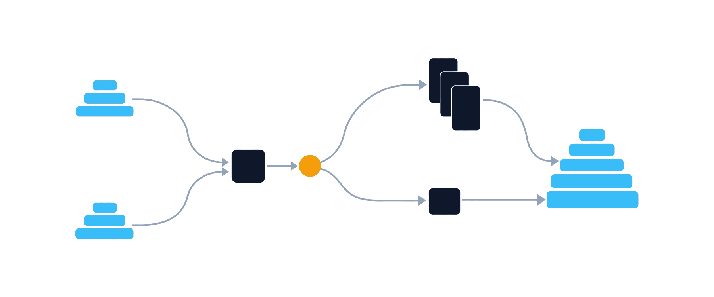

<p align="center"></p>

<h1 align="center">Ptah</h1>

<p align="center">Open-source database schema management, from design to deployment.</p>

<p align="center">
  <a href="https://github.com/stokaro/ptah/actions/workflows/go-unit-tests.yml?query=branch%3Amaster"></a>
  <a href="https://github.com/stokaro/ptah/releases/latest"></a>
  <a href="https://pkg.go.dev/go.5x5.cz/ptah"></a>
  <a href="https://github.com/stokaro/ptah/blob/master/go.mod"></a>
  <a href="https://github.com/stokaro/ptah/blob/master/LICENSE"></a>
</p>

<p align="center"><a href="#install">Install</a> · <a href="https://stokaro.github.io/ptah/edge/">Documentation</a> · <a href="https://stokaro.github.io/ptah/edge/start/quick-start/">Quick start</a> · <a href="https://stokaro.github.io/ptah/edge/databases/support-matrix/">Supported databases</a></p>

<p align="center">
  <a href="https://stokaro.github.io/ptah/edge/databases/postgresql/">PostgreSQL</a> ·
  <a href="https://stokaro.github.io/ptah/edge/databases/support-matrix/">MySQL</a> ·
  <a href="https://stokaro.github.io/ptah/edge/databases/support-matrix/">MariaDB</a> ·
  <a href="https://stokaro.github.io/ptah/edge/databases/sqlite/">SQLite</a> ·
  <a href="https://stokaro.github.io/ptah/edge/databases/sqlserver/">SQL Server</a> ·
  <a href="https://stokaro.github.io/ptah/edge/databases/support-matrix/">ClickHouse</a> ·
  <a href="https://stokaro.github.io/ptah/edge/databases/support-matrix/">CockroachDB</a> ·
  <a href="https://stokaro.github.io/ptah/edge/databases/support-matrix/">YugabyteDB</a> ·
  <a href="https://stokaro.github.io/ptah/edge/databases/support-matrix/">Oracle</a> ·
  <a href="https://stokaro.github.io/ptah/edge/databases/support-matrix/">Spanner</a>
</p>

Ptah reads the schema you want, compares it with the schema a live database
already has, and turns the difference into SQL you can review, apply, or roll
back. The `ptah` binary runs on its own and needs no Go toolchain. The
[database support matrix](https://stokaro.github.io/ptah/edge/databases/support-matrix/)
gives the dialect name and URL scheme each engine uses, and how deep the support
goes.

<p align="center"><picture>
  <source media="(prefers-color-scheme: dark)" srcset="docs/site/src/assets/readme-hero-dark.png">
  
</picture></p>

<p align="center">One comparison, two routes: the difference becomes migration files you review, or a change applied now. Both arrive at the same database.</p>

> [!NOTE]
> Ptah is pre-GA. The native command tree can still change.

## Two ways to change a schema

A schema source is the schema you want, written as SQL, YAML, HCL, or DBML, or
read from annotations in Go code. Ptah compares a schema source with a live
database and hands you the difference along one of two routes.

| Workflow | You write | Pick it when | Start with |
| --- | --- | --- | --- |
| Versioned migrations | Numbered SQL files kept in version control | a person reviews the change before it runs, and the file belongs in the pull request | `ptah migrations generate` |
| Declarative schema changes | The schema you want, in any supported source format | the declared schema is the source of truth, and drift is the thing you fix | `ptah schema apply` |

The two combine. One command reads a schema source, compares it with a live
database, and writes the difference as a reversible migration pair:

```bash
ptah migrations generate --db-url "sqlite://app.db" --schema-file schema.sql \
  --migrations-dir ./migrations --name create_users
```

[Choose a workflow](https://stokaro.github.io/ptah/edge/start/choose-a-workflow/)
compares the two in detail.

## What Ptah does

Each row is one capability, the command to start from, and the page that owns
it. Deterministic means the same inputs produce the same SQL on every run.

| Capability | Start with | Read |
| --- | --- | --- |
| Migration integrity | `ptah migrations validate` | [Integrity and safety](https://stokaro.github.io/ptah/edge/versioned/integrity-and-safety/) |
| Deterministic planning | `ptah schema plan` | [Apply directly](https://stokaro.github.io/ptah/edge/direct/apply/) |
| Drift detection | `ptah schema drift` | [Compare and drift](https://stokaro.github.io/ptah/edge/direct/compare-and-drift/) |
| Approvals | `ptah schema approve` | [Native commands](https://stokaro.github.io/ptah/edge/reference/native-commands/) |
| Advisory locking | `ptah schema apply --lock-timeout` | [Capabilities](https://stokaro.github.io/ptah/edge/reference/capabilities/) |
| Recovery | `ptah migrations down` | [Roll back migrations](https://stokaro.github.io/ptah/edge/versioned/rollback/) |
| Testing | `ptah schema test` | [Test migrations and schemas](https://stokaro.github.io/ptah/edge/testing/migrations-and-schema/) |
| Artifact distribution | `ptah schema push` | [OCI registry artifacts](https://stokaro.github.io/ptah/edge/operate/oci-registry/) |
| Diagrams | `ptah viz` | [Visualize the schema](https://stokaro.github.io/ptah/edge/schema/visualize/) |
| API contract export | `ptah schema export` | [API schema export](https://stokaro.github.io/ptah/edge/schema/export/) |

Not every engine provides every capability. Advisory locking is the clearest
example: PostgreSQL, YugabyteDB, MySQL, MariaDB and SQL Server take a lock, and
on the remaining engines the migration runs without one.
`ptah db capabilities --db-url <url>` resolves it for one server.

## Install

The released archives carry `ptah`, `ptah-compat`, and `ptah-ls` for Linux,
macOS, and Windows on `amd64` and `arm64`; the Windows ones are `.zip`. Download
with `curl`, as below, rather than through a browser: the macOS binaries are
ad-hoc signed, and macOS quarantines such a binary when a browser fetches it.

```bash
set -euo pipefail

VERSION="$(curl -sSL https://api.github.com/repos/stokaro/ptah/releases/latest \
  | sed -n 's/.*"tag_name": *"\([^"]*\)".*/\1/p')"
OS="$(uname -s | tr '[:upper:]' '[:lower:]')"
ARCH="$(uname -m)"
[ "$ARCH" = "x86_64" ] && ARCH=amd64
[ "$ARCH" = "aarch64" ] && ARCH=arm64
ARCHIVE="ptah_${VERSION#v}_${OS}_${ARCH}.tar.gz"

cd "$(mktemp -d)"
curl -sSLO "https://github.com/stokaro/ptah/releases/download/${VERSION}/${ARCHIVE}"
curl -sSLO "https://github.com/stokaro/ptah/releases/download/${VERSION}/checksums.txt"
if command -v sha256sum >/dev/null; then
  sha256sum --ignore-missing -c checksums.txt
else
  shasum -a 256 --ignore-missing -c checksums.txt
fi

tar -xzf "$ARCHIVE"
sudo install -m 0755 ptah ptah-compat ptah-ls /usr/local/bin/
ptah version
```

`set -euo pipefail` is what makes the checksum a gate: without it a failed
comparison is followed by the install anyway. The archive has no top-level
directory, which is why the binaries are installed one by one. The
[install guide](https://stokaro.github.io/ptah/edge/start/install/) covers the
Go toolchain path and building from a checkout.

Every documentation link in this file points at the `edge` channel, which is
built from `master` and describes this tree rather than the release the command
above installs. The
[documentation front door](https://stokaro.github.io/ptah/) opens the newest
released version instead.

## Run it end to end

Three `ptah` commands against SQLite, then cleanup. No server, no credentials,
no Docker.

### Write the schema

Save the schema you want as `schema.sql`. This one is plain SQL:

```sql
CREATE TABLE users (
    id INTEGER PRIMARY KEY,
    email TEXT NOT NULL UNIQUE,
    created_at TEXT NOT NULL
);
```

### See the SQL

```bash
ptah schema render --schema-file schema.sql --dialect sqlite
```

Expected output includes:

```sql
-- Statement 1/1
CREATE TABLE "users" (
  "id" INTEGER PRIMARY KEY,
  "email" TEXT NOT NULL UNIQUE,
  "created_at" TEXT NOT NULL
);
```

Ptah writes the payload to standard output and progress messages to standard
error, so the block above is what a pipe receives.

### Apply it

```bash
ptah schema apply --db-url "sqlite://app.db" --schema-file schema.sql --auto-approve
```

Expected output includes:

```text
Auto-approval enabled; applying schema changes.
Schema apply completed successfully.
```

> [!CAUTION]
> `--auto-approve` answers the confirmation prompt for you, and a declarative
> apply drops the objects the schema no longer declares. It is here because
> `app.db` is a throwaway file. Against a database whose contents matter, run
> the command without the flag and read the plan it prints, or save one first
> with `ptah schema plan`.

### Check for drift

`ptah schema drift` exits 0 when the database and the file agree and 1 when
they do not, so it also works as a CI gate:

```bash
ptah schema drift --db-url "sqlite://app.db" --schema-file schema.sql
```

Expected output includes:

```text
No schema drift detected.
```

When you are done, remove the database with `rm app.db`.

## Where to go next

| I want to | Read |
| --- | --- |
| Run my first migration | [Quick start](https://stokaro.github.io/ptah/edge/start/quick-start/) |
| Decide between the two workflows | [Choose a workflow](https://stokaro.github.io/ptah/edge/start/choose-a-workflow/) |
| Bring a database Ptah did not create under management | [Adopt an existing database](https://stokaro.github.io/ptah/edge/start/adopt-an-existing-database/) |
| Write the schema in SQL, YAML, HCL, DBML, or an external loader | [Work with a desired schema](https://stokaro.github.io/ptah/edge/schema/work-with-a-source/) |
| Read the schema a live database already has | [Inspect a database](https://stokaro.github.io/ptah/edge/direct/inspect/) |
| Gate a pull request on schemas and migrations | [CI](https://stokaro.github.io/ptah/edge/testing/ci/) |
| Check engine support and dialect differences | [Database support matrix](https://stokaro.github.io/ptah/edge/databases/support-matrix/) |
| Look up a command, a format, or an exit code | [Native commands](https://stokaro.github.io/ptah/edge/reference/native-commands/), [Exit codes](https://stokaro.github.io/ptah/edge/reference/exit-codes/) |
| Diagnose a failure | [Troubleshooting](https://stokaro.github.io/ptah/edge/operate/troubleshooting/) |

The site source lives in [`docs/site`](docs/site). [`docs/README.md`](docs/README.md)
indexes the contributor and implementation documents that sit beyond it.

## Use Ptah from Go

The CLI needs no Go toolchain. Go projects can also embed Ptah through its
documented packages, use Go annotations as one schema source, and run the
`ptah-ls` language server for annotation support in an editor.

- [Public Go API](https://stokaro.github.io/ptah/edge/extend/public-api/)
- [Reusable components](https://stokaro.github.io/ptah/edge/extend/components/)
- [Go annotations](https://stokaro.github.io/ptah/edge/schema/go-annotations/)

Runnable examples: [schema visualization](examples/viz),
[embedded migrator](examples/migrator), [annotation parser](examples/annotation_parser).

## Atlas compatibility

A separate `ptah-compat` binary presents an Atlas-compatible command surface for
scripts written against the Atlas CLI, invoked as `ptah-compat <command> ...`.
The native `ptah` binary has no Atlas command paths; its migration verbs live
under `ptah migrations`. The two binaries share capabilities, not command lines.

Ptah does not claim full Atlas parity. The
[Atlas compatibility overview](https://stokaro.github.io/ptah/edge/atlas/overview/)
explains what the surface covers and where it differs, and
[Conformance](https://stokaro.github.io/ptah/edge/atlas/conformance/) summarizes
the measurements taken in
[`stokaro/ptah-atlas-conformance`](https://github.com/stokaro/ptah-atlas-conformance).

## License and provenance

Ptah is published under the [MIT license](LICENSE). It is an independent
implementation that does not use Atlas source code and is not affiliated with or
endorsed by Ariga. The
[license boundary](https://stokaro.github.io/ptah/edge/atlas/license-boundary/)
page records the provenance policy and its legal basis. `ptah license` prints
the license and attribution from the binary itself.

## The name

Ptah is the Egyptian god of architects and craftsmen. The name also spells the
four stages a schema change moves through: **Parse** a schema source,
**Transform** it into statements for one dialect, **Apply** the change, and
**Harmonize** the database with the schema you declared.

## Get help

Open an issue at
[github.com/stokaro/ptah/issues](https://github.com/stokaro/ptah/issues).
