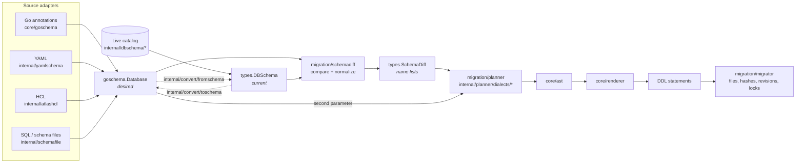
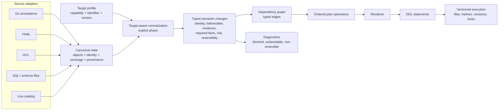
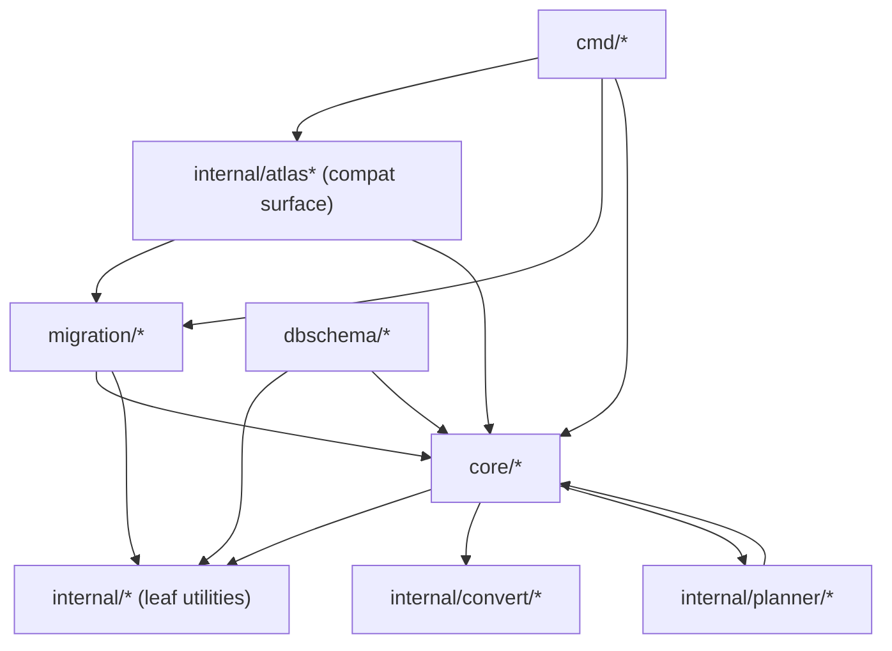
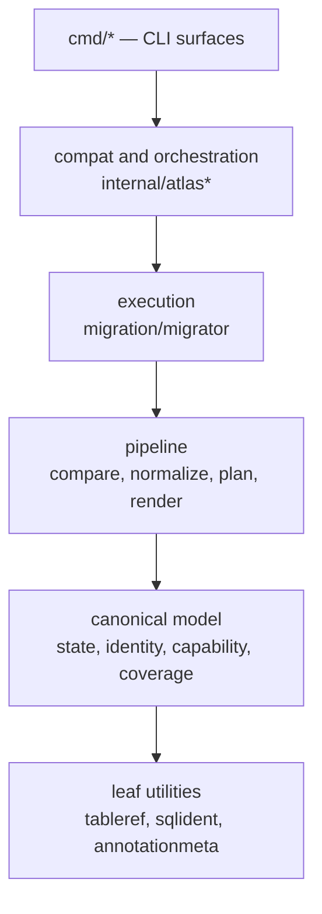

# ADR 0001: Canonical schema state and pipeline boundaries

- Status: proposed
- Deciders: Ptah maintainers
- Issue: [#1349](https://github.com/stokaro/ptah/issues/1349), under [#1343](https://github.com/stokaro/ptah/issues/1343)
- Supersedes: nothing
- Prototype: [#1350](https://github.com/stokaro/ptah/issues/1350)

## 1. Context

Ptah reads a schema from several sources, compares it against a live database,
plans a change, renders DDL, and applies it. Each of those steps exists and
works. What does not exist is one agreed answer to "what is a schema, in this
codebase" — and the absence has a measurable shape.

Everything in this section was measured against the tree at the commit this ADR
lands on, not taken from a sibling issue. #1349 lists the #1344 inventory, the
#1346 coverage contract and the #1348 target-profile contract among its inputs;
those issues are open and labeled post-ga, so the facts below were derived from
the code instead. Where a decision depends on a fact one of those issues would
have supplied, this ADR says so and states the assumption.

The one input that did land is [#1345](https://github.com/stokaro/ptah/issues/1345):
the identity and reference model in `internal/objectidentity`, documented in
[object identity and references](../object_identity.md). This ADR treats that
model as decided and builds on it rather than reopening it.

### 1.1 There are two schema states, not one

| | `core/goschema.Database` | `dbschema/types.DBSchema` |
| --- | --- | --- |
| Role | Desired schema, from every authoring source | Current schema, from a live catalog |
| Object slices | 21, plus three `map[string][]string` relations | 19, two of which are not object families |
| Only here | `Fields`, `EmbeddedFields`, `ManagedData`, `RLSEnabledTables`, `EmbeddedSources`, and the three relation maps | `RolesOutOfScope`, `UnregisteredVirtualTables` |
| Spelled differently | `MaterializedViews`, `CompositeTypes` | `MatViews`, `Composites` |
| Coverage record | `NotDescribed coverage.Set` | `RolesOutOfScope []string` |
| Public API | Yes | Yes |

Both types are in the public API snapshot, so neither can be replaced in place
before GA without a breaking change. That constraint drives several decisions
below.

Four packages under `internal/convert` exist to move between them:
`toschema`, `dbschematogo`, `goschematogo`, and `fromschema`. Conversion is not
a corner of the codebase; it is a layer.

### 1.2 The diff is a name list, and the planner compensates

`migration/schemadiff/types.SchemaDiff` is a flat struct of per-family slices:
`TablesAdded []string`, `TablesRemoved []string`, `ConstraintsRemovedWithTables
[]ConstraintRemovalInfo`, and so on for every family. A change carries no
identity value, no before/after state, no evidence, no risk, no reversibility,
and no provenance.

The consequence is visible in the planner's own signature:

```go
func GenerateSchemaDiffAST(diff *types.SchemaDiff, generated *goschema.Database, dialect string) ([]ast.Node, error)
```

The planner takes the diff **and** the desired schema, because the diff does not
carry what rendering an addition needs. `TablesAdded` is a list of names; the
columns come from `generated`. That second parameter is the compensation, and it
is why a renderer can silently plan against a description that no longer matches
the diff it was handed.

The diff has grown one exception to the name-list rule, and the exception proves
the cost: `IdentifierSemantics *identifier.Semantics` was added so planners stop
guessing the folding rule. It is a pointer, and it is nil for dialect-only
comparisons, so every consumer carries a fallback path.

### 1.3 The top-level directories are not layers

Import edges between top-level groups, counted with `go list -deps`:

| Edge | Count | Reverse | Count |
| --- | --- | --- | --- |
| `internal` → `core` | 179 | `core` → `internal` | 33 |
| `migration` → `internal` | 57 | `internal` → `migration` | 50 |
| `internal` → `dbschema` | 26 | `dbschema` → `internal` | 10 |
| `cmd` → `internal` | 145 | — | 0 |

Go forbids package cycles, so these are not cycles — they are evidence that the
groups do not name layers. `internal/` holds both leaf utilities that sit below
`core/` (`internal/tableref`, `internal/annotationmeta`) and orchestration that
sits above `migration/` (`internal/atlasschema`, `internal/atlasmigrate`). Two
edges are worth naming individually:

- `core/renderer` → `internal/convert/fromschema` and
  `internal/planner/tablelookup`: the renderer reaches into conversion and
  planning.
- `internal/planner/dialects/{postgres,mysql,sqlite,clickhouse}` construct
  `goschema.Database` values: the planner synthesizes desired-schema
  descriptions rather than consuming them.

Decision 11 asks for forbidden dependency directions. Today there is nothing for
such a rule to attach to.

### 1.4 What already works and must not be discarded

The tree is not short of good parts, and the ADR's job is partly to say which
ones the canonical model adopts rather than replaces:

- `core/platform/identifier.Semantics` — per-target identifier folding, already
  the single source for how a name compares.
- `core/platform/capability` — a typed capability registry with presets,
  version ladders, and a probe that measures each key against a live server.
- `core/coverage.Set` — "what this description does not claim to describe",
  with kind and object granularity, already merged across sources.
- `internal/objectidentity` — the identity and reference model from #1345.
- `migration/schemadiff/internal/normalize` — target-aware normalization of
  types, defaults and expressions, currently reachable only from comparison.

Four of the five are already typed and tested. The canonical model's job is to
give them one place to attach, not to reinvent them.

## 2. Data flow

### 2.1 Today



The dotted conversion edges and the "second parameter" edge are the two shapes
this ADR sets out to remove.

### 2.2 Target



One state, produced by every adapter including the catalog reader. One
normalization phase, named and reachable. Changes that carry what the planner
and renderer need, so neither has to re-read the source description.

## 3. Package dependencies

### 3.1 Today



`core/` both sits under `migration/` and reaches into `internal/planner` and
`internal/convert`, which sit beside or above it.

### 3.2 Target



Forbidden directions, in the order they matter:

1. **L1 must not import L2.** The canonical model cannot depend on comparison,
   planning or rendering. This is the rule `core/renderer` →
   `internal/planner/tablelookup` breaks today.
2. **L2 must not construct source descriptions.** A planner that builds a
   `goschema.Database` is reading a source it was not handed.
3. **L2 must not import L3.** Planning must not know about migration files,
   hashes, revision tables or locks.
4. **A renderer must not import a comparator.** If rendering needs a fact, the
   change carries it.

These are enforceable mechanically, and enforcing them is the first step of
section 8's plan rather than a later cleanup.

## 4. Canonical state invariants

1. **One state type describes both sides.** A description read from a catalog
   and one read from an authoring source are the same type. "Current" and
   "desired" are roles a value plays, not shapes it has.
2. **Every object carries an identity.** The identity is
   `objectidentity.ID`, with the source spelling and comparison value as
   separate components, per [object identity and references](../object_identity.md).
3. **Identity is not derived from a name at use time.** An object's identity is
   assigned when the object is read, by the adapter that knows the source's
   quoting and defaulting rules. No later stage re-parses a name.
4. **Absence and silence are different values.** A description states what it
   does not claim to describe. `coverage.Set` is that statement, and a stage
   that cannot distinguish "not present" from "not described" must refuse
   rather than assume.
5. **Provenance attaches to an object and never joins its identity.** Two
   objects that differ only in which file declared them are one object.
6. **Source syntax is retained, and is not semantics.** The exact spelling an
   author wrote is kept for rendering and diagnostics; no comparison reads it.
7. **A dialect-specific attribute is typed.** A generic bag may carry a
   non-semantic annotation. It may never carry a fact that changes a plan.
8. **Normalization is a named phase with an explicit target profile.** It is
   not a set of calls scattered through comparison, and it never runs twice on
   one value.
9. **A change carries everything its consumers need.** If a planner or renderer
   has to consult the source description, the change is incomplete.
10. **Unknown never plans destruction.** A stage that cannot establish a fact
    emits a blocked or undecidable change with a diagnostic, never a drop.
11. **The state is deterministic.** Two runs over the same input produce
    identical ordering, whatever the map iteration order.
12. **Managed data is not schema state.** It references schema objects by
    identity and is planned separately.

## 5. Decisions

Each decision states the alternatives, the choice, and why. Where only one
option is viable, the reason is written out rather than the alternatives faked.

### D1. Canonical schema-state shape

**Alternatives.** (a) One struct of typed per-family slices, the shape both
current types already have. (b) One flat collection of objects keyed by
identity, with per-family accessors. (c) An interface per family with dialect
implementations.

**Decision: (b), a collection keyed by identity, with typed per-family views.**

(a) is the shape that produced the present situation: adding a family means
adding a slice to two structs and a converter between them, and nothing forces
the two to agree. Two families are already spelled differently on the two sides
and one exists on only one of them. (c) makes every traversal a type switch and pushes dialect
behavior into the model, which invariant 7 rules out.

(b) makes invariant 1 mechanical: a family is a `Kind` plus a typed payload, and
a stage that walks "every object" cannot miss one because a slice was not added
to its switch. The typed views keep the call sites that legitimately want "all
tables" readable.

### D2. Source syntax and provenance

**Alternatives.** (a) Fields on the object, beside its semantic attributes.
(b) A side table keyed by identity. (c) A generic metadata map.

**Decision: (a) fields, with a compile-time separation from the semantic ones.**

(b) is where facts go to be dropped: every stage that constructs a new object
has to remember to carry the side table, and #1345's evidence is that stages do
not remember. (c) is ruled out by invariant 7 — an unvalidated bag cannot hold
a safety-critical fact, and provenance is used in diagnostics that operators
act on.

The separation is structural: semantic attributes live in the object's own
fields, and spelling and provenance live in one embedded value whose type has no
comparison methods. A comparator that reads provenance has to name it.

### D3. Dialect-specific objects and attributes

**Alternatives.** (a) Lowest common denominator; dialect extras are dropped.
(b) Every dialect attribute on the common object, unset elsewhere. (c) A typed
extension per dialect, attached to the object and carried opaquely by stages
that do not understand it.

**Decision: (c), typed extensions.**

(a) is the failure #1343 exists to end. (b) makes the common object the union of
every dialect, which is where `goschema.Database` is heading and why it carries
twenty-one object slices and three relation maps.

(c) requires each stage to declare whether it understands an extension. A stage
that does not, carries it unchanged and cannot silently drop it — dropping is
what turns "Ptah does not support this" into "Ptah removed this".

### D4. Schema state versus managed and reference data

**Alternatives.** (a) Managed data inside the canonical state, as
`goschema.Database.ManagedData` is today. (b) A separate model that references
schema objects by identity. (c) Out of scope for the canonical pipeline.

**Decision: (b).**

(a) forces every schema stage to skip a family that is not a schema object, and
the skip is invisible until one forgets. (c) is not honest: managed data
references tables and columns, so a rename has to reach it.

(b) keeps the reference typed. A managed-data row naming a renamed column is a
dangling reference, and #1345's `Resolve` already answers that with a refusal
class rather than a guess.

### D5. Typed knowledge, coverage, certainty, and target facts

**Alternatives.** (a) Booleans per fact. (b) A tri-state per fact: known-true,
known-false, undecided. (c) A fact value carrying its evidence.

**Decision: (c), building on `capability` and `coverage`.**

The capability probe already distinguishes measured-true, measured-false and
undecidable, and its floor check exists because a skipped measurement that reads
as a passed one is the failure mode. (a) cannot express that. (b) can, but
throws away where the answer came from, which is what a diagnostic needs when a
change is blocked.

A required target fact on a change names the capability key. A change whose
required fact is undecided is blocked, with the key in the diagnostic, and the
operator learns which measurement is missing rather than that something failed.

This decision assumes #1346 will not contradict the shape `coverage.Set` and
`capability.Capabilities` already have. It is the assumption most exposed by
#1346 being open; if #1346 lands a different contract, D5 is the decision to
revisit, and nothing else here depends on its internals.

### D6. Convergence of current and desired schema

**Alternatives.** (a) Convert the catalog read into the authoring shape, as
`internal/convert/toschema` does now. (b) Convert the authoring shape into the
catalog shape, as `fromschema` does now. (c) Both adapters produce the canonical
state directly.

**Decision: (c).**

The tree currently does (a) and (b) at once — four converter packages, two
directions — and each conversion is a place where a fact can be lost with no
gate that notices. (c) deletes the direction question. A catalog reader and an
HCL parser are peers, and neither is expressed in terms of the other.

### D7. Target-aware normalization

**Alternatives.** (a) Keep it inside comparison, where
`migration/schemadiff/internal/normalize` lives. (b) A named phase between state
and comparison. (c) Normalize at read time, in each adapter.

**Decision: (b).**

(a) makes it unreachable to planning and rendering, which is why the planner
receives `IdentifierSemantics` on the diff as a nullable afterthought. (c) makes
every adapter depend on the target, so one description cannot be compared
against two targets.

(b) gives the phase one input — the target profile — and one output, and makes
invariant 8's "never twice" checkable. The verbatim constructors #1345 added to
`objectidentity` exist because that invariant is violated today; under (b) they
have a deletion criterion.

### D8. Comparison, planning, rendering, execution

**Alternatives.** (a) Keep the current split with a richer diff. (b) Merge
comparison and planning, since the planner already needs the desired schema.
(c) Keep the split and make the change type complete enough that the planner
needs nothing else.

**Decision: (c).**

(b) is the tempting reading of the `GenerateSchemaDiffAST` signature, and it is
the wrong one: the second parameter is a symptom of an incomplete change type,
not evidence that the two stages are one. Merging them would make every planner
a comparator and multiply dialect-specific comparison.

Under (c) the boundary is testable in one sentence: a planner that compiles
without access to the source description is a planner that cannot rediscover a
diff.

### D9. Declarative planning versus versioned migration

**Alternatives.** (a) One pipeline, with file and revision concerns as options.
(b) A hard boundary: planning produces operations, and versioned execution
consumes them.

**Decision: (b), and it is the only viable one.**

Files, hashes, revision tables, locks and dirty-state recovery are properties of
how a plan is delivered, not of what it changes. A planner that knows about them
cannot be tested without them, and the `internal` → `migration` edge count in
section 1.3 shows how quickly that spreads. There is no credible alternative
that keeps planning testable.

### D10. Source-adapter and projection contracts

**Alternatives.** (a) Each adapter defines its own entry point, as today.
(b) One adapter interface: read a source, return canonical state plus its
coverage statement.

**Decision: (b).**

Coverage is the reason. `NotDescribed` exists on the authoring type and
`RolesOutOfScope` on the catalog type, and they say the same thing in two
shapes. An adapter contract that returns state and coverage together makes
invariant 4 impossible to skip: an adapter that describes nothing about a family
has to say so to return at all.

The compatibility projection is an adapter in both directions and is bound by
the same contract. It never gets a private path into the pipeline.

### D11. Package ownership and forbidden directions

**Decision:** the five layers and four forbidden directions in section 3.2,
enforced by a check script in `scripts/`, added before any package moves.

The order matters. A rule added after the migration documents what happened; a
rule added first fails the first commit that breaks it. The repository already
has seventeen such scripts and the pattern is established.

### D12. Temporary adapters and removal criteria

**Decision:** every adapter introduced by this migration carries, in its own doc
comment, the condition under which it is deleted. An adapter without one is not
merged.

This is already the rule #1345 followed: `docs/object_identity.md` gives each
alias and each verbatim constructor a deletion criterion, and one of them —
`ConstraintPartsVerbatim` — is deleted by D7 landing. That is the pattern, and
it is what keeps "temporary" from meaning "unowned".

## 6. Alternatives table

The three whole-shape alternatives, scored against the axes #1349 names. This is
the top-level choice; the per-decision alternatives are in section 5.

| Axis | A: richer diff, keep two states | B: canonical state, new path beside the old | C: rewrite the pipeline in place |
| --- | --- | --- | --- |
| Correctness | Fixes the planner's second parameter; leaves two states and four converters | Fixes both; each conversion deleted rather than documented | Same end state |
| Safety | Conversion loss stays, unmeasured | Old path stays until the new one is measured equivalent | No fallback during the change |
| Extensibility | A new family still means two structs and a converter | A new family is one kind and one adapter clause | Same as B |
| Maintainability | Lowest immediate cost, highest carrying cost | Two paths to maintain during migration | Lowest carrying cost, highest risk |
| Testability | Differential testing impossible: one path | Differential testing is the method | Only end-to-end tests can judge it |
| Performance | Unchanged | One extra state per run during shadow comparison | Unchanged |
| Migration | Incremental, never converges | Incremental, converges when the old path is deleted | Not incremental; the tree is red in the middle |

**Selected: B.** C is ruled out by the constraint that the repository stays
buildable and testable at each step. A is the option that looks cheapest and
never finishes: it makes the diff richer without removing the reason two states
exist, so the fourth converter is still cheaper to write than the fifth is to
delete.

## 7. Public API

**Decision: the canonical model is internal until the prototype in #1350 is
accepted.**

`goschema.Database` and `dbschema/types.DBSchema` are both in
`docs/public_api.snapshot`, so neither can be changed in place before GA. That
is a constraint on the migration, not on the model: the canonical state lives
under `internal/`, the two public types become projections of it, and their
current shape is preserved by the snapshot gate that already exists.

Promoting any of it before the slice has run is the mistake this ADR most wants
to avoid. A public model is one that cannot be revised by what the prototype
finds, and revising it is the prototype's stated purpose.

## 8. Staged migration plan

Each stage ends with the tree buildable, the suite green, and something
measurable that was not measurable before.

| Stage | Work | Owner artifact | Done when | Adapter deleted by |
| --- | --- | --- | --- | --- |
| 0 | Layer rule script; fix the two edges in section 1.3 | `scripts/check-layer-directions.sh` | The script fails on a reverted fix | — |
| 1 | Canonical state type, identity-keyed, no consumers | `internal/schemastate` | Round-trips both public types | — |
| 2 | Adapter contract; catalog reader and one authoring source implement it | `internal/schemastate/adapter.go` | Both produce state and coverage | `toschema`, `fromschema` after stage 6 |
| 3 | Target profile and the normalization phase | `internal/schemastate/normalize` | Normalization is reachable from planning | `ConstraintPartsVerbatim` at this stage |
| 4 | Typed change model with evidence and required facts | `internal/schemachange` | A change renders without the source description | The planner's second parameter at stage 6 |
| 5 | Typed dependency graph; forward and rollback from one source | `internal/schemachange/graph` | Rollback order derives from the same edges | — |
| 6 | The #1350 slice runs end to end beside the existing path | prototype | Differential tests pass or differences are documented | Stage 2 and 4 adapters |
| 7 | Per-family migration issues, decomposed by evidence from stage 6 | issues | Each names its own deletion criterion | — |

Stages 0 through 5 are additive: nothing existing changes behavior. Stage 6 is
where the two paths are compared, and it is the first stage that can invalidate
this ADR.

## 9. Slice selection for #1350

#1350 requires a family exercising scoped and quoted identity, typed
references, both input sides, target-aware normalization, semantic modification,
dependency ordering, forward planning, rollback or explicit non-reversibility,
dialect-specific behavior, coverage and uncertainty, and diagnostics.

| Candidate | Why it was not chosen |
| --- | --- |
| Tables and columns | Exercises everything, and is too large to run beside the existing path without the prototype becoming the migration |
| Enums | No dependency ordering, no meaningful rollback, PostgreSQL only |
| Sequences | Thin: identity and ownership, little else |
| Views | Dependency ordering and dialect spread, but no scoped-and-quoted identity beyond the table case, and modification is replacement |

**Selected: foreign-key constraints.**

Against each requirement, with the evidence that already exists:

| Requirement | How the family exercises it |
| --- | --- |
| Scoped and quoted identity | The constraint name is scoped to its table; both components may be quoted and may contain dots — the #1311 shape |
| Typed references | A foreign key references another table and its columns; a dangling or out-of-scope reference is exactly #1345's refusal classes |
| Both input sides | Read from a live catalog and declared in Go annotations, YAML and HCL |
| Target-aware normalization | Referential actions, and identifier folding on both the constraint and its targets |
| Semantic modification | An `ON DELETE` change is a modification the comparator expresses as remove plus add of one name — the #189 case |
| Dependency ordering | A foreign key orders its two tables, and a self-referencing one is its own case, already modeled in `SelfReferencingForeignKeys` |
| Rollback and non-reversibility | Dropping one is reversible; adding one to a table with violating rows is not |
| Dialect-specific behavior | Measured across the matrix: MySQL and MariaDB reject `MODIFY` on a participating column and force drop-and-recreate; SQLite rebuilds the table; ClickHouse parses no `FOREIGN KEY` clause at all |
| Coverage and uncertainty | A reader that did not inspect constraints must not produce a drop |
| Diagnostics | A blocked add names the violating rows or the missing target fact |
| Existing evidence | `capability.DeferrableConstraints` and `capability.ForeignKeys` are probed on every matrix cell, and the family has regression fixtures from #189, #197, #694 and #1624 |

It is the smallest family that fails to be trivial on any axis.

## 10. Test strategy

**Differential.** The new path and the existing path run over the same input,
and their rendered statements are compared. A difference is either a defect or
an entry in a documented-differences file; there is no third outcome. The file
is a test fixture, so a difference cannot be added without a reviewer seeing it.

**Determinism.** Every differential run repeats with a shuffled map insertion
order. Go randomizes map iteration already; the shuffle makes the failure
reproducible rather than occasional.

**Mutation.** Each property below has a mutant that must turn a test red. A
mutant that does not apply or does not compile is reported separately from a
surviving one — an unapplied mutant reads exactly like a covered one otherwise.

| Property | Mutant |
| --- | --- |
| Identity is not lost | Drop a component from the change's identity |
| Coverage is not flattened | Treat "not described" as "not present" |
| Target facts are required | Render a change whose required fact is undecided |
| Graph edges are kept | Drop one edge class from the dependency graph |
| Order is deterministic | Replace the sort with map iteration order |
| Rollback is derived | Invent a rollback for a non-reversible change |

**Live.** The representative target behaviors run against real engines: the
MySQL family's drop-and-recreate, SQLite's table rebuild, and PostgreSQL's
deferrable case. These are behaviors the matrix already measures, so the
prototype inherits the cells rather than adding a contour.

**Conformance.** Where the surface is compatibility-facing, the existing
conformance fixtures run against the new path unchanged.

**Benchmark.** One large schema through both paths. The acceptance bar is that
the new path is within the same order of magnitude; a canonical state that costs
one extra allocation per object is expected, and one that costs a second full
comparison is not.

## 11. Adversarial validation

The scenarios #1349 requires, each answered by a decision or invariant above.

| Scenario | Answer |
| --- | --- |
| Quoted and unquoted qualified identifiers | Invariant 2 and 3: identity is assigned by the adapter that knows the source's quoting, and folding applies to the spelling as written. `"Users"` and `Users` stay two objects on PostgreSQL |
| Overloaded routines | `objectidentity.ID` carries `Signature`. Comparison does not use it yet — an open gap recorded in [object identity and references](../object_identity.md) — and D1's identity-keyed collection is what makes wiring it a change in one place |
| A reader that did not inspect one object family | Invariant 4 and D10: the adapter returns its coverage statement, and the family reads as not-described rather than empty. Invariant 10 then forbids a drop |
| An out-of-scope schema | `ErrInvalidScope` from #1345, plus D4 for managed data referencing across the boundary |
| A target version beyond measured capability data | D5: the required fact is undecided, the change is blocked, and the diagnostic names the capability key. The probe's floor check is the existing precedent |
| A dialect-specific object absent from another dialect | D3: a typed extension, carried opaquely by stages that do not understand it, never dropped silently |
| A non-reversible semantic change | D8 and the change model: reversibility is a field, and stage 5 derives rollback from the same edges. Inventing one is a mutation the test strategy kills |
| Managed data referencing a renamed table or column | D4: the reference is typed, so a rename makes it dangling and `Resolve` refuses rather than guessing |
| Compatibility projection needing syntax the native surface lacks | D10: the projection is an adapter under the same contract. It may carry a typed extension the native surface does not render, and it may not have a private path into the pipeline |

## 12. Definition of done

- [x] Every required decision has at least two credible alternatives or a written reason only one is viable — D9 is the single-option case, with the reason stated.
- [x] Selected boundaries satisfy the #1343 invariants without duplicating a full pipeline per dialect or surface — dialect behavior is a typed extension and a capability fact, not a pipeline.
- [x] Safety-critical facts are typed and validated — D3 and D5; invariant 7 forbids a bag.
- [x] Managed data and versioned execution have explicit boundaries — D4 and D9.
- [x] The migration plan keeps the repository buildable and testable at each step — section 8; stages 0 through 5 are additive.
- [x] The representative slice is selected by evidence, not convenience — section 9 rejects four candidates by name and lists the existing fixtures.
- [ ] Maintainers approve the ADR before broad production migration begins.

## 13. Consequences

**Accepted.** Two paths exist between stage 6 and the last per-family migration.
That is the cost of measuring equivalence rather than asserting it, and section 8
gives every adapter a deletion condition so the cost is bounded.

**Accepted.** The canonical state costs one more representation during the
migration. The benchmark in section 10 is where that stops being acceptable.

**Rejected.** Nothing in this ADR moves a package for naming consistency, and
nothing stabilizes a public API. Both are #1349 non-goals and both remain
non-goals after it.

**Open.** D5 assumes #1346 will not contradict the shape `coverage.Set` and
`capability.Capabilities` already have, and section 9's dialect claims assume
#1348 does not change how a target profile is assembled. Both issues are open.
If either lands a different contract, D5 and D7 are the decisions to revisit;
the rest of this ADR does not depend on their internals.
