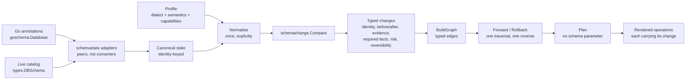

# The canonical-pipeline prototype

This page records what the [ADR 0001](adr/0001-canonical-schema-state-and-pipeline-boundaries.md)
prototype does, what it measured, what it changed about the ADR, and what it
deliberately does not do. It is the evidence half of
[#1350](https://github.com/stokaro/ptah/issues/1350); the code is
`internal/schemastate` and `internal/schemachange`.

The prototype runs beside the existing path. Nothing in the shipped product
calls it, and no behavior changes.

## The slice

Foreign-key constraints, chosen in ADR 0001 section 9 against four rejected
candidates. The prototype models tables, their columns, and foreign keys — the
columns because a foreign key depends on their type, nullability and
uniqueness, and nothing else because a prototype whose scope is implicit is one
whose gaps read as answers.

The scope is a value on the state rather than a comment. A reader declares the
families it looked at, and a comparison against a state that never looked at
constraints is refused instead of reading its silence as "drop every foreign key
the database has".

## The pipeline



The stage that matters most is the last arrow into `Plan`. Its signature is

```go
func Plan(changes []Change, profile schemastate.Profile) ([]PlannedOperation, error)
```

against the existing path's

```go
func GenerateSchemaDiffAST(diff *types.SchemaDiff, generated *goschema.Database, dialect string) ([]ast.Node, error)
```

The second parameter there is where the planner recovers what a diff of name
lists dropped. The prototype has nothing for it to recover, so the compiler
enforces the boundary rather than a convention.

## What the prototype found

Four things, and three of them were found by a test rather than by reading.

### 1. Invariant 2 is not about identifiers

ADR 0001 states that the source spelling and the comparison value are distinct,
and states it for the components of a name. The prototype normalized an
unspecified `ON DELETE` to `NO ACTION` so a document that wrote nothing and a
catalog that reports `NO ACTION` compare as one foreign key — and then rendered
the normalized value, writing `ON DELETE NO ACTION` into DDL the author wrote
without it.

The differential test against the existing path is what caught it. The rule
generalizes: **any** value where a comparison folds and a renderer emits needs
both, not only an identifier component. `schemastate.Action` now carries the
pair, exactly as `objectidentity.Part` does.

This is a revision to the ADR, recorded here rather than by editing it.

### 2. Scope and coverage are two concepts, not one

ADR 0001 decision 10 says an adapter returns state and coverage together. The
prototype found that "coverage" means two different things:

- which objects a description **declines to describe**, for the families where
  absence is ambiguous — that is `core/coverage.Set`, whose kind list is closed
  and contains no tables, columns or constraints, because their absence is never
  ambiguous;
- which families a reader **looked at at all** — which is what a prototype
  covering one family needs, and what a partial reader needs.

Forcing the second into the first would widen a closed list built for the first.
The state carries both.

### 3. A rejoin loses what two components said

`schemastate` first built a constraint identity by rendering its owning table
and handing the string to a constructor that splits it. The rendered form
carries a kind prefix, so the ALTER statement came out naming a table called
`"table public"."child"`.

The fix was `objectidentity.ConstraintParts`, the folding sibling of the
verbatim constructor the planners use. The lesson is the one
[object identity and references](object_identity.md) invariant 5 already
states, met a second time in a new place.

### 4. This slice's dependency graph cannot cycle

Every edge the graph derives runs between a table and a constraint, and a table
that is not itself changing contributes no node, so the derived graph is a
forest. The cycle diagnostic is kept — table creations order against each other,
and that is where a cycle is reachable — and it is tested directly, because an
unreachable guard with no test is a guard nobody has ever seen work.

## Measurements

### Differential against the existing path

Both paths render the same input; the constraint statements are compared. The
comparison is scoped to lines naming the family, because the existing path emits
a block per table where the prototype emits one statement per change; the test
asserts that no dropped line names a foreign key, so a constraint statement
cannot leave through the filter.

**No differences.** The three rows are an addition, an addition carrying a
referential action, and an unchanged schema.

The test is not vacuous: reverting the invariant-2 fix — rendering the folded
action instead of the source spelling — turns it red.

### Live, against PostgreSQL 18

The plan is applied to a real database in its own schema, and the catalog is
asked what it produced.

| Step | Statement applied | `information_schema.referential_constraints` |
| --- | --- | --- |
| Add with `ON DELETE CASCADE` | `ALTER TABLE "child" ADD CONSTRAINT ...` | `delete_rule` = `CASCADE` |
| Modify to `SET NULL` | drop, then add | `delete_rule` = `SET NULL` |
| Remove | `ALTER TABLE "child" DROP CONSTRAINT ...` | no rows |

The blocked case is measured against the engine rather than asserted: a foreign
key whose referenced column carries no unique constraint is blocked offline, and
PostgreSQL refuses the same statement with `there is no unique constraint
matching given keys`. The block is the engine's rule, not one this repository
invented.

The live test is not vacuous either: emitting the modification's add before its
drop makes PostgreSQL answer `constraint "fk_child_parent" for relation "child"
already exists`.

### Mutation

Fifteen mutants, one per property #1350 names plus the fail-closed and
normalization rules. **All fifteen applied, compiled and were killed; none
survived.** A deliberate non-mutant, whose anchor does not exist, is reported
`PATCH-FAILED` so a sweep that measures nothing cannot read as a clean one.

| Property | Mutant |
| --- | --- |
| Identity is not lost | Drop the owning table from the key; use the verbatim constructor where folding is needed |
| Coverage is not flattened | Make the scope check always pass |
| Target facts are required | Check no required facts; render a blocked change; skip the unique-reference precondition |
| Graph edges are kept | Drop the referenced-table edge |
| Order is deterministic | Iterate the object map instead of insertion order; sort edges instead of following change order |
| Rollback is derived | Return the forward traversal unreversed |
| Unknown never plans destruction | Tolerate a dangling reference; pass an unknown referential action through |
| Normalization runs once | Allow a second normalization; accept an unnormalized side |
| Source spelling is rendered | Render the folded referential action |

### Determinism

The whole pipeline runs twenty-four times over one input; the statements do not
move. The graph's edges are asserted by content and order, not only by
stability, so an edge class cannot disappear and stay green.

### Benchmark

Five hundred foreign keys, one addition each, on an Apple M3 Pro:

| Path | ns/op | B/op | allocs/op |
| --- | --- | --- | --- |
| Prototype | 73,897,583 | 272,874,211 | 307,510 |
| Existing | 178,715,548 | 788,798,425 | 630,047 |

Read this as "the canonical state does not cost an order of magnitude", which is
the ADR's acceptance bar, and not as a speedup. The two paths do different
amounts of work: the existing one compares every object family and plans whole
tables, the prototype compares one family. A like-for-like number needs the
whole model, which is what the per-family migration produces.

## What this does not do

- No object family other than foreign keys, and none of the surrounding
  families — tables, columns and indexes are read, not planned.
- No source adapter other than Go annotations and the catalog. HCL and YAML
  reach `goschema.Database` first, so they are covered transitively rather than
  directly, and a native adapter for each is per-family migration work.
- No integration with the CLI, the migration generator, or versioned execution.
  ADR 0001 decision 9 puts that boundary deliberately outside the prototype.
- No public API. The model stays internal until the ADR is accepted, because a
  public model is one the prototype cannot revise.
- Composite uniqueness is not modeled: a column that is unique only as part of a
  multi-column constraint reads as not unique, which blocks a foreign key the
  target might have accepted. That is conservative in the safe direction, and it
  is the first thing the constraint family's own migration fixes.
