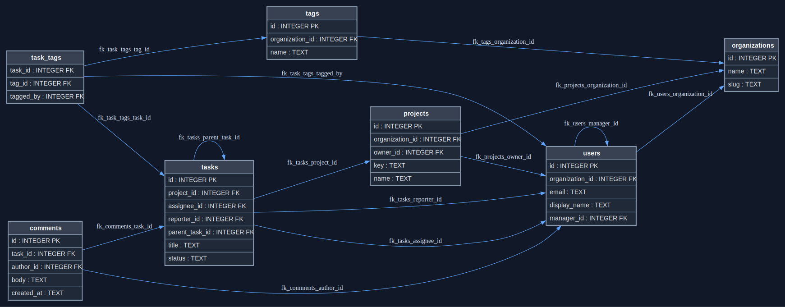

# Schema Visualization Example

This example shows the output of `ptah viz` on a SQLite schema with several
relationship shapes:

- organization-owned entities;
- a user hierarchy through a self-reference;
- project and task ownership edges;
- task comments;
- tag assignment through a join table;
- another self-reference for parent tasks.

The checked-in artifacts are generated outputs, not hand-written diagrams:

- [schema.sql](schema.sql) is the SQLite input schema.
- [models/schema.go](models/schema.go) is generated by `ptah introspect`.
- [schema.mmd](schema.mmd) is Mermaid `erDiagram` output.
- [schema.dot](schema.dot) is Graphviz DOT output.
- [schema.svg](schema.svg) is dark-theme SVG output rendered through Graphviz.



To regenerate the example from the repository root:

```bash
rm -f /tmp/ptah-viz-example.db
sqlite3 /tmp/ptah-viz-example.db '.read examples/viz/schema.sql'

go run ./cmd/ptah introspect \
  --db-url sqlite:///tmp/ptah-viz-example.db \
  --out examples/viz/models \
  --package models \
  --single-file

go run ./cmd/ptah viz \
  --root-dir examples/viz/models \
  --format mermaid \
  --include-columns \
  > examples/viz/schema.mmd

go run ./cmd/ptah viz \
  --root-dir examples/viz/models \
  --format dot \
  --include-columns \
  > examples/viz/schema.dot

go run ./cmd/ptah viz \
  --root-dir examples/viz/models \
  --format svg \
  --include-columns \
  --theme dark \
  > examples/viz/schema.svg
```
