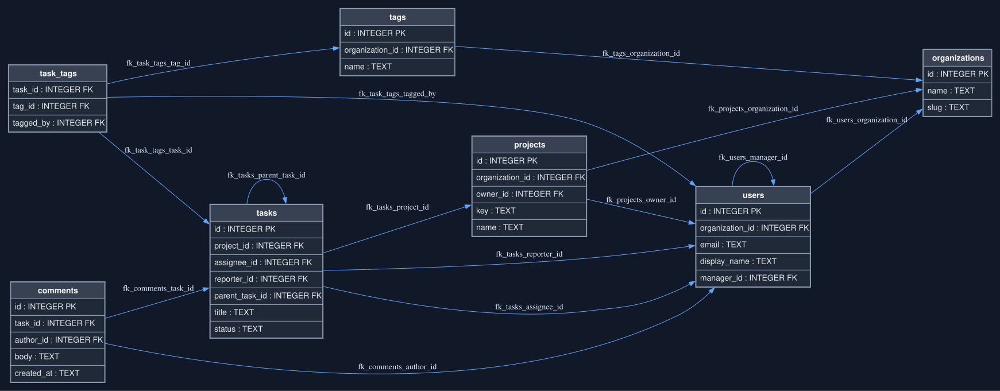

# Schema visualization example

## What this example demonstrates

This fixture renders a connected schema with organization ownership, user and
task self-references, task comments, and tag assignment through a join table.
The Mermaid, DOT, and SVG files are generated Ptah output rather than
hand-authored diagrams.



## Prerequisites

- The Go toolchain declared in the repository's `go.mod`, or a built `ptah`
  binary on `PATH`.
- Graphviz `dot` only when regenerating the SVG.
- SQLite only when regenerating the annotated models from `schema.sql`.

## Run

From the repository root, generate Mermaid output into a temporary file and
compare it with the committed artifact:

```bash
output=$(mktemp)
go run ./cmd/ptah viz \
  --root-dir examples/viz/models \
  --format mermaid \
  --include-columns > "$output"
cmp "$output" examples/viz/schema.mmd
rm "$output"
```

## Expected result

`cmp` exits 0. The Mermaid output begins with `erDiagram`, lists seven tables,
and includes fourteen foreign-key relationships.

## Verify

The repository example gate regenerates both Mermaid and DOT into a temporary
directory and compares them byte for byte. It also checks that `schema.svg` is
an SVG with the same table names and accessible title metadata.

## Regenerate every artifact

Run these commands from the repository root after an intentional output change:

```bash
rm -f /tmp/ptah-viz-example.db
sqlite3 /tmp/ptah-viz-example.db '.read examples/viz/schema.sql'

go run ./cmd/ptah introspect \
  --db-url sqlite:///tmp/ptah-viz-example.db \
  --out examples/viz/models \
  --package models \
  --single-file

go run ./cmd/ptah viz \
  --root-dir examples/viz/models \
  --format mermaid \
  --include-columns \
  > examples/viz/schema.mmd

go run ./cmd/ptah viz \
  --root-dir examples/viz/models \
  --format dot \
  --include-columns \
  > examples/viz/schema.dot

go run ./cmd/ptah viz \
  --root-dir examples/viz/models \
  --format svg \
  --include-columns \
  --theme dark \
  > examples/viz/schema.svg
```

Review the diff. A diagram that renders but loses a table or relationship is
not an acceptable regeneration.

## Cleanup

Remove `/tmp/ptah-viz-example.db`. The short verification path removes its own
temporary output.

## Learn more

Use [Visualize the schema](https://stokaro.github.io/ptah/edge/schema/visualize/)
for format choices, filtering, security annotations, and failure modes.
